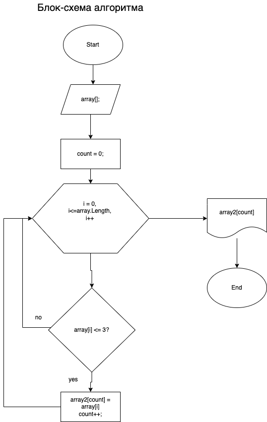

Задание:

Написать программу, которая из имеющегося массива строк формирует массив из строк, 
длина которых меньше либо равна 3 символам. 
Первоначальный массив можно ввести с клавиатуры либо задать на старте алгоритма.
Не пользоваться коллекциями. Обойтись исключительно массивами.
Например:  ["hello", "2", "World", ":-)"] -> ["2", ":-)"]

Алгоритм решения:

